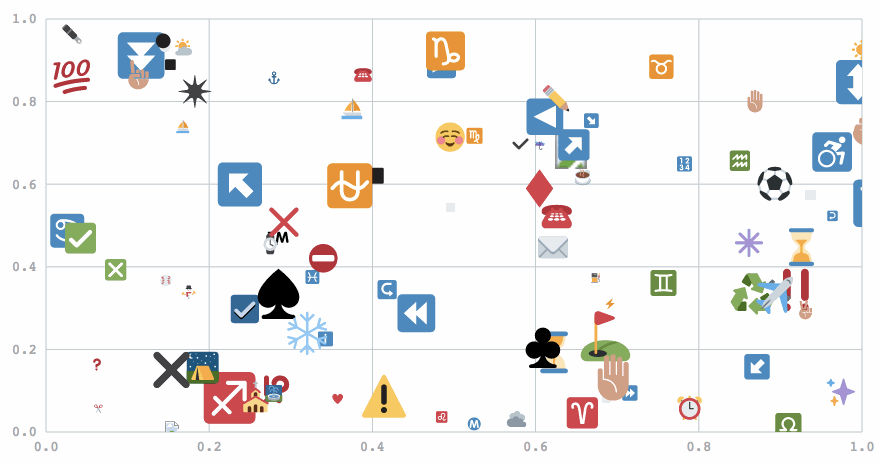

:chart_with_upwards_trend: First class emoji support for D3



## installation

### CommonJS

```
npm install d3moji
```

```js
var d3 = require('d3')
require('d3moji')(d3); // require and apply the plugin
```


### old school

The plugin is automatically applied when d3 is found on the window object.

```html
<script src="path/to/d3.js" />
<script src="path/to/d3moji.js" /> 
```


## usage

### Adding emoji to the svg

```js

svg
    .append('emoji')
    .attr('symbol', 'smile') // codes taken from http://www.emoji-cheat-sheet.com/ the enclosing :colons: aren't necessary
    // do all the standard d3 stuff
    .attr('width', 30)
    .attr('height', 30)
    .attr('x', function(d) {
        return d[0];
    })
    .attr('y', function(d) {
        return d[1];
    })

```

### selecting emoji

```js
d3.select('emoji'); // select the first one found
d3.selectAll('emoji'); // select all emoji
```


## attribution

This project uses the open source [twemoji](https://github.com/twitter/twemoji) emoji svgs from twitter.

## faq

**why do you use the twitter emojis?** I couldn't find open SVG sets for the others. PR's welcome if you know more about this.

## LICENSE 
MIT
